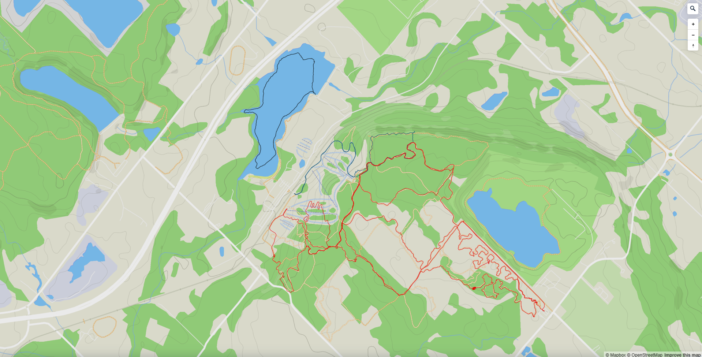
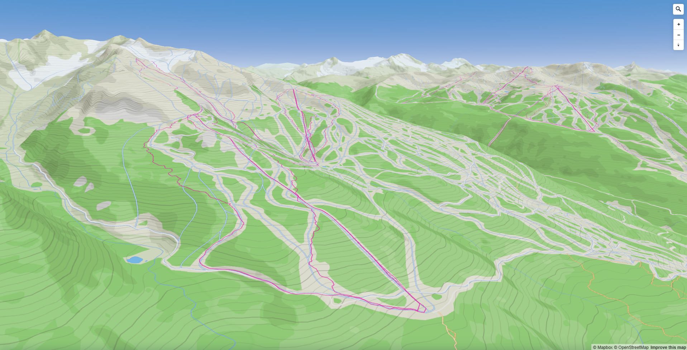
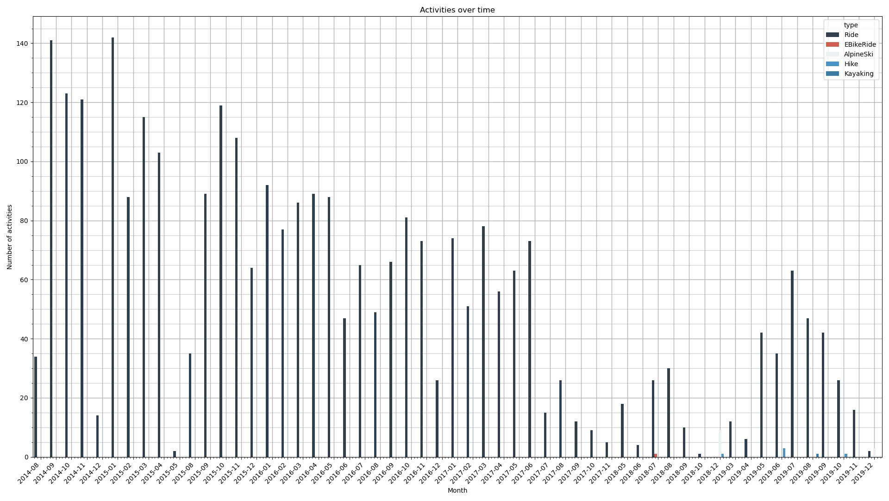
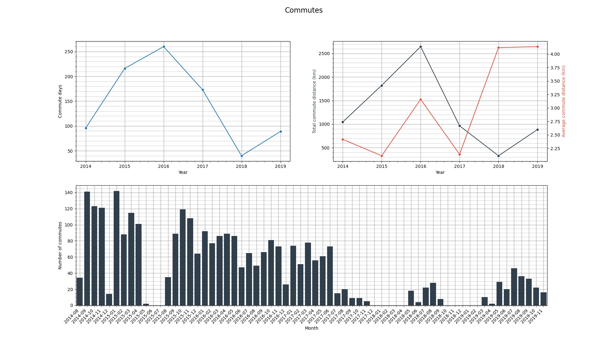
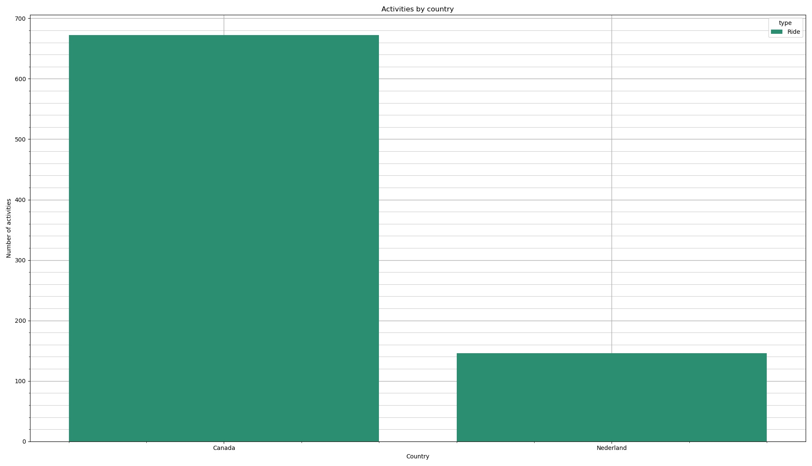

# Stravalyse

A Python tool to help analyse and visualise Strava activity data using Pandas and [Mapbox Studio](https://www.mapbox.com/mapbox-studio).

## Introduction

Stravalyse offers a simple way to gather, store, and process your Strava activity data. It stores everything in human-readable JSON, enabling you to uncover new training insights using Pandas, export the geospatial data as GeoJSON, or generate a tileset and upload it to Mapbox to create personalised maps of your adventures.

Stravalyse further enriches the data provided by Strava by:

- Looking up and storing the activity start and end addresses using reverse geocoding.
- Parsing and extracting custom data embedded in your activity descriptions with user-defined tags.

The tool includes a limited set of analysis features to use as inspiration, though these are not actively maintained.

## Installation

Stravalyse is developed with Python 3.12. Simply clone and open the repository locally and install the Python package using `pip`:

```sh
cd stravalyse
pip install . 
```

### Strava API access

The tool needs to be registered as an app with Strava to access the Strava API. This takes a few steps:

1. From https://www.strava.com/settings/api, create a new application and set the 'Authorization Callback Domain' field to `localhost`.
2. Create a `.env` file in the Stravalyse root directory.
2. Copy the generated client ID and store it in the `.env` file with the key `STRAVA_CLIENT_ID`. Do the same for the client secret with the key `STRAVA_CLIENT_SECRET`:

```python
STRAVA_CLIENT_ID = "YOUR_CLIENT_ID"
STRAVA_CLIENT_SECRET = "YOUR_CLIENT_SECRET"
```

When you run Stravalyse for the first time, it will open a browser window and request permission to connect to Strava. Click 'Authorize' to give it access to your Strava data (this includes activities marked as 'private'). Note that only read permissions are requested; the tool is not capable of adding, modifying, or deleting any activities from your personal profile.

After authorizing access, the browser will redirect to an invalid page (`http://localhost`) and return an error. The returned URL, however, is valid and contains the access code required for Stravalyse to authenticate itself with the Strava API. The URL will be in the form:

`http://localhost/?state=&code=xxxxxxxxxxxxxxxxxxxxxxxxxxxxxxxxxxxxxxxx&scope=read,activity:read_all`

When prompted, copy the `&code=` portion of the URL (`xxxxxxxxxxxxxxxxxxxxxxxxxxxxxxxxxxxxxxxx`) and paste it into the console. The tool will get and refresh its own OAuth2 tokens, so you only need to do this once.

### Mapbox Studio API access

If you want Stravalyse to upload your data to Mapbox Studio, you will need to create a Mapbox [account](https://account.mapbox.com/) and generate an API access token from the [access tokens](https://console.mapbox.com/account/access-tokens/) page. Store it in the same `.env` file as your Strava credentials with the key `MAPBOX_TOKEN`:

```python
STRAVA_CLIENT_ID = "YOUR_CLIENT_ID"
STRAVA_CLIENT_SECRET = "YOUR_CLIENT_SECRET"

MAPBOX_TOKEN = "YOUR_TOKEN"
```

## Usage

Once installed, run the tool by calling it in a terminal window:

```sh
stravalyse
```

The following command line options are available:

| Command | Description |
| ------- | ------------|
| `-a / --activity_count_plot` | Generate and display a plot of activity counts over time. |
| `-c / --commute_plots` | Generate and display plots of the commute data. |
| `-d / --mean_distance_plot` | Generate and display a plot of the mean activity distance over time. |
| `-g / --export_geo_data` | Export the geospatial activity data in GeoJSON format. |
| `-gu / --export_upload_geo_data` | Export the geospatial activity data in GeoJSON format and upload it to Mapbox Studio. |
| `-l / --start_locations_plot` | Generate and display a plot of the number of activities started in each country. |
| `-m / --moving_time_heatmap` | Generate and display a heatmap of moving time for each activity type. |
| `-r / --refresh_data` | Get and store a fresh copy of the activity data. |
| `--date_range_start` | Specify the start of a date range in ISO format. |
| `--date_range_end` | Specify the end of a date range in ISO format. |

You can also see the list of options using the `-h` or `--help` option.

### Configuration

All user-configurable parameters are stored within the `config.toml` file in the root directory.

The `[paths]` section allows you to choose where to store the data files:

```toml
[paths]
strava_tokens_file = ''
activity_data_file = ''
geo_data_file = ''
```

The `[data]` section allows you to enable reverse geocoding and to apply it to activities that were previously fetched with reverse geocoding disabled. Note that reverse geocoding increase the time taken to download your activity data from Strava, as it uses a free service with low rate limits:

```toml
[data]
reverse_geocoding = true
update_existing_activities = true
```

You can define an arbitrary number of custom description tags using the following format:

```toml
[[data.description_tags]]
tag_name = 'Skis:'
column_name = 'ski_type'
activity_types = ["AlpineSki", "BackcountrySki", "NordicSki"]
```

In this example, Stravalyse will look through all new activities marked as a `AlpineSki`, `BackcountrySki` or `NordicSki`, extract the line of text immediately following the tag 'Skis:' in the activity descriptions, and store the data in the column `ski_type` in the Pandas dataframe. You can use this feature to store almost any data you find relevant: the skis you used for a ski activity, your final race position during a sailing regatta, or the types of rapids you ran during a whitewater kayak.

The `[mapbox]` section gives you control over the name and zoom level of the tileset uploaded to Mapbox Studio. A zoom level of 16 provides the highest level of detailed currently supported by Mapbox (~1 m resolution), but you may incur data processing fees depending on how large your tileset is and how frequently you upload it. As a reference, a relatively large dataset of 5,500 activities in 12+ countries can be uploaded twice a month with a zoom level of 16 without incurring any charges. Reducing the zoom level to <=15 should ensure you avoid any fees if your dataset is much larger or you want to upload it more frequently. 

```toml
[mapbox]
tileset_name = 'YOUR_NAME.StravaGeoData'
tileset_zoom_level = 16
```

The `[plots]` section lets you choose the colour palettes and wrapping style used for the generated plots:

```toml
[plots]
plot_colour_palette = "Dark2"
heatmap_colour_palette = "viridis"
heatmap_column_wrap = 5
```

### Mapbox Studio

When using the `-gu` option, Stravalyse generates an `MBTiles` tileset of your activity data and uploads it to Mapbox Studio. From there, you can create a base map with the colour theme of your choice, add your activity data as a layer, and use the included metadata (name, activity type, distance, elevation gain, or description) to format the activity traces however you want. In the following examples, the activities are colour-coded by type (mountain biking in red, hiking in blue, stand-up paddleboarding in black, and skiing in purple):





Refer to the [Mapbox Documentation](https://docs.mapbox.com/) for more information on how to create your maps.

### Plots

From release v1.2.0 onwards, the tool is capable of generating some basic plots from your Strava data. The types of plots currently supported are described in the release notes, but here are some examples:









